## SQL
The commands in SQL are non-sensitive, so I can use uppercase or lowercase.   
### Some of The most Important SQL Commands
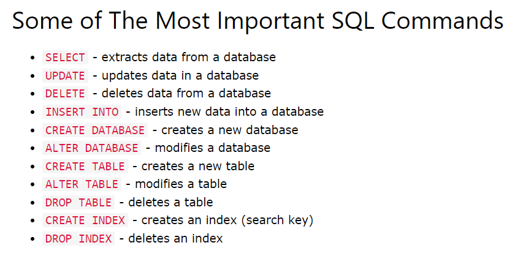   
### DISTINCT
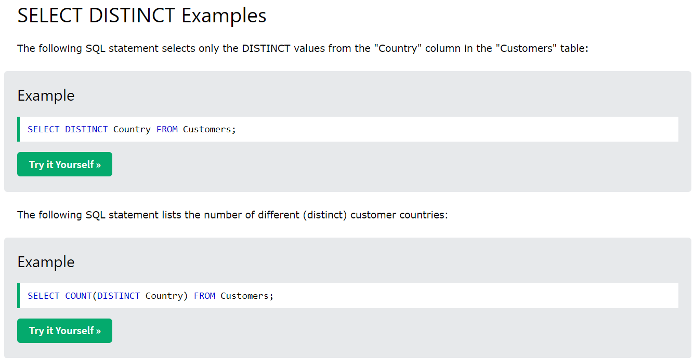   
### WHERE
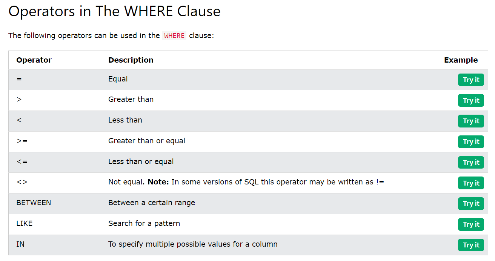   
### AND
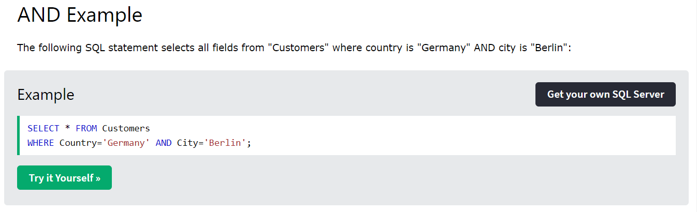   
### OR
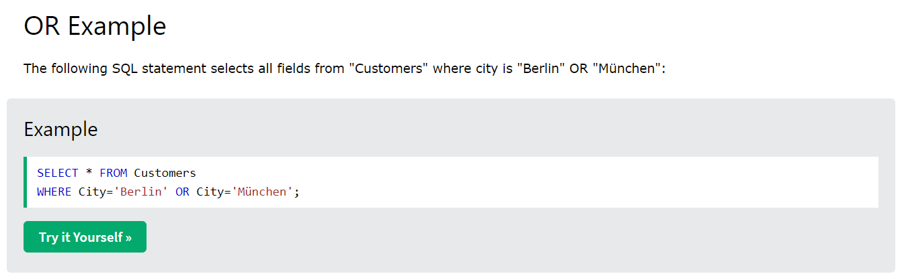   
### NOT
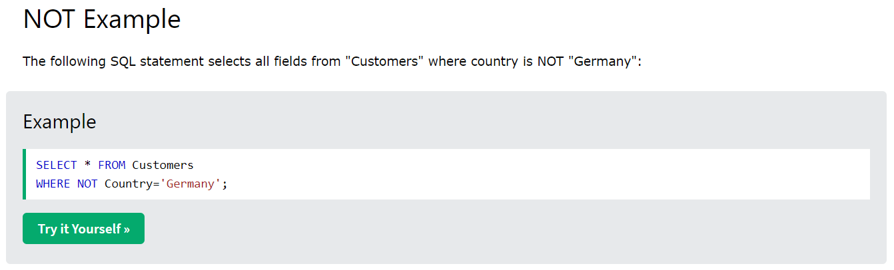   
### Combine
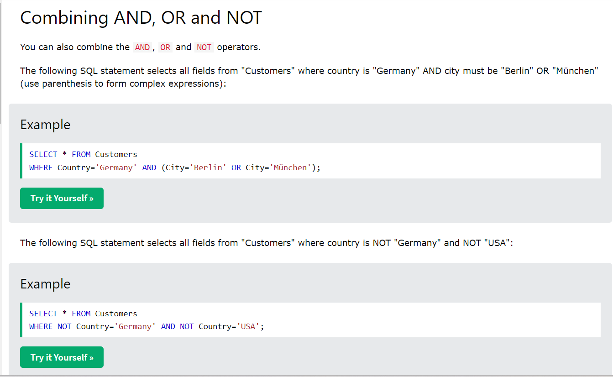   
### ORDER BY (DESC)
> The ORDER BY keyword sorts the records in ascending order by default. To sort the records in descending order, use the DESC keyword.   

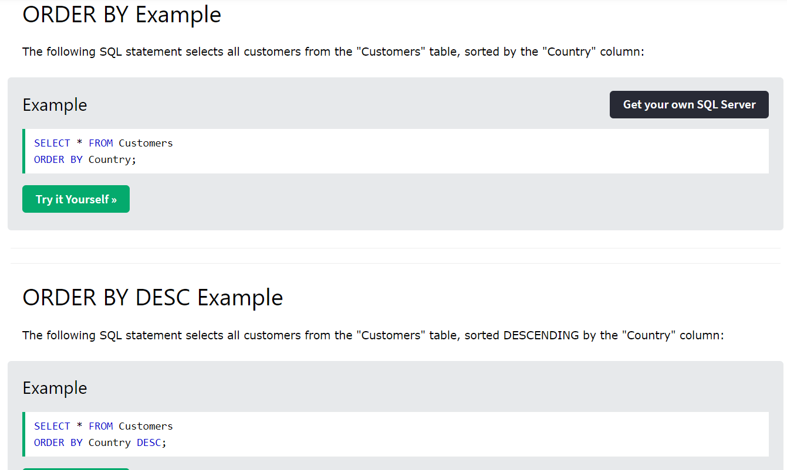   
### INSERT INTO VALUES
   
### IS (NOT) NULL
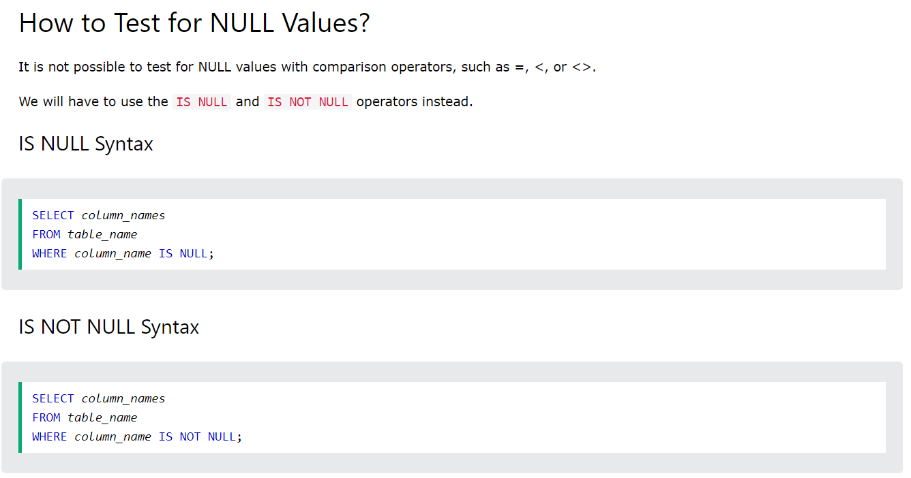   
### UPDATE SET
> Be careful when updating records in a table! Notice the WHERE clause in the UPDATE statement. The WHERE clause specifies which record(s) that should be updated. If you omit the WHERE clause, all records in the table will be updated!   

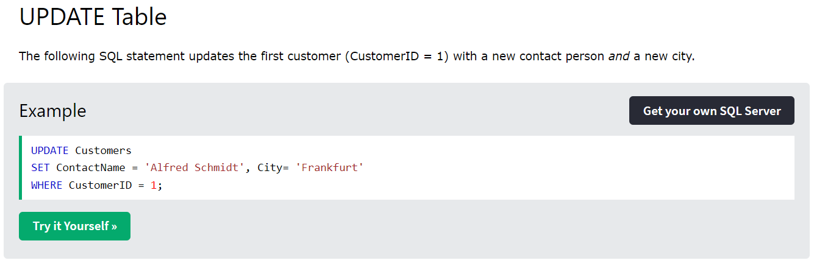   
### DELETE FROM
> Be careful when deleting records in a table! Notice the WHERE clause in the DELETE statement. The WHERE clause specifies which record(s) should be deleted. If you omit the WHERE clause, all records in the table will be deleted!   

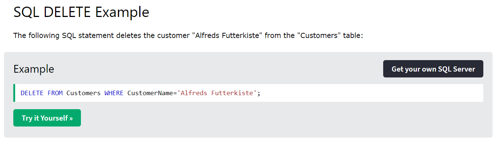   
### SELECT TOP 10 (PERCENT)
> Not all database systems support the SELECT TOP clause. MySQL supports the LIMIT clause to select a limited number of records, while Oracle uses FETCH FIRST n ROWS ONLY and ROWNUM.

   
### AVG
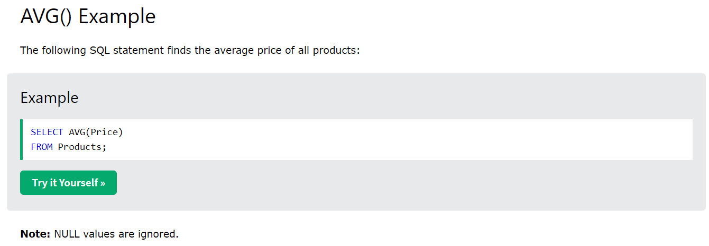   
### COUNT
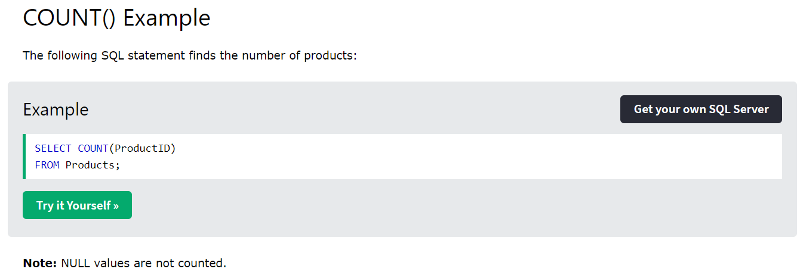   
### MIN, MAX
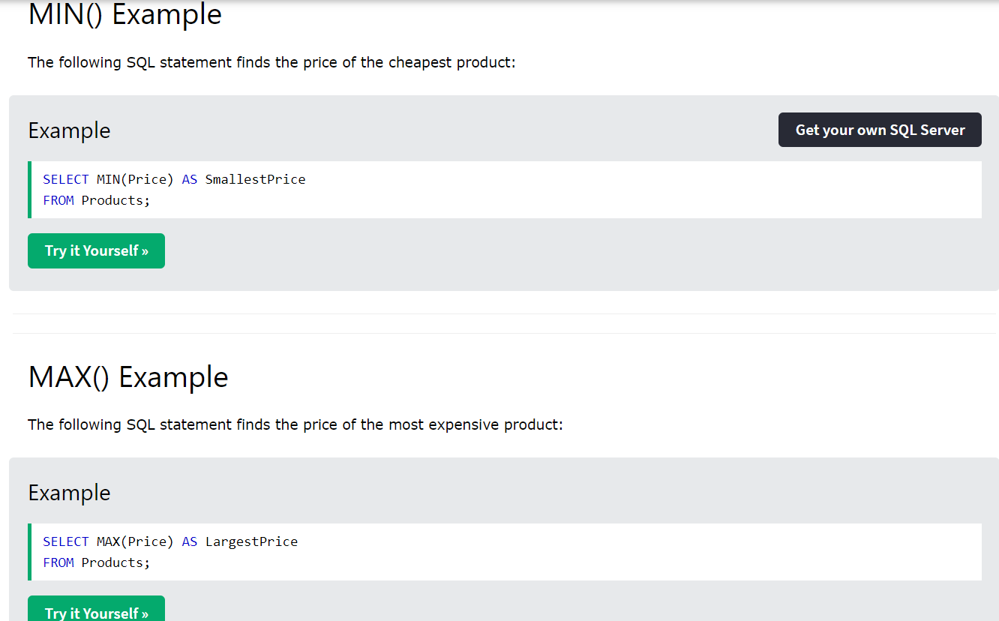   
### SUM
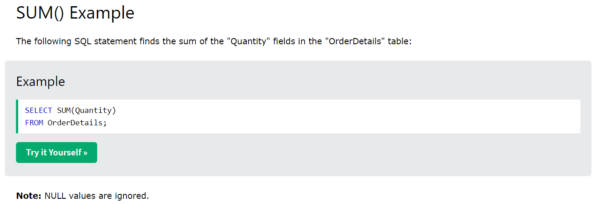   
### LIKE
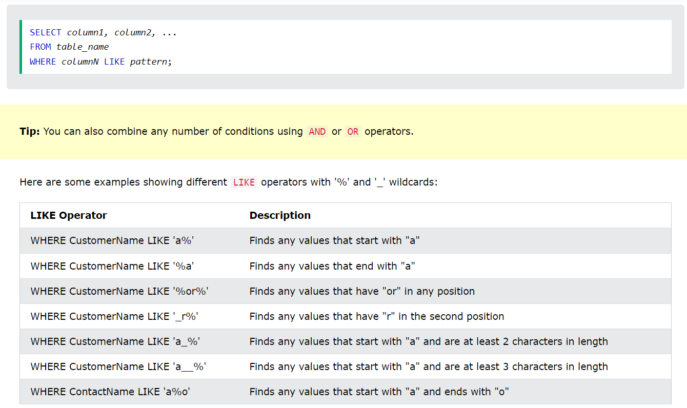   

## References
* [w3school](https://www.w3schools.com/sql/default.asp)   